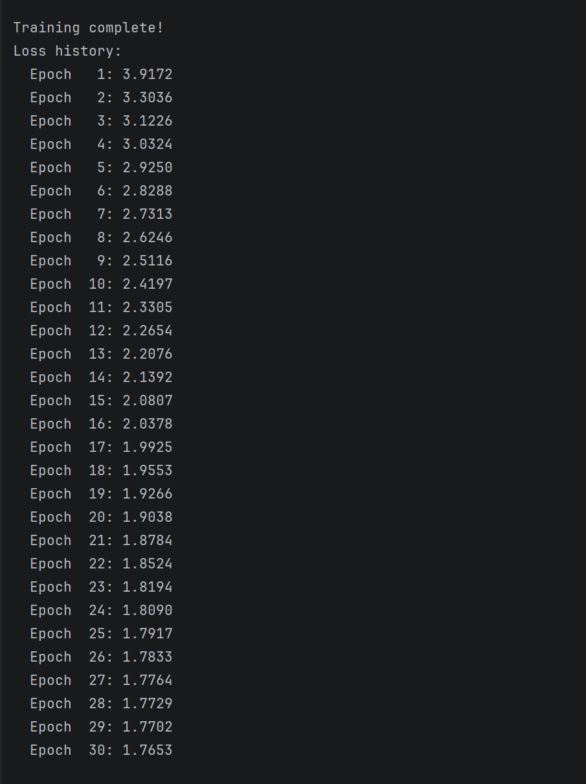
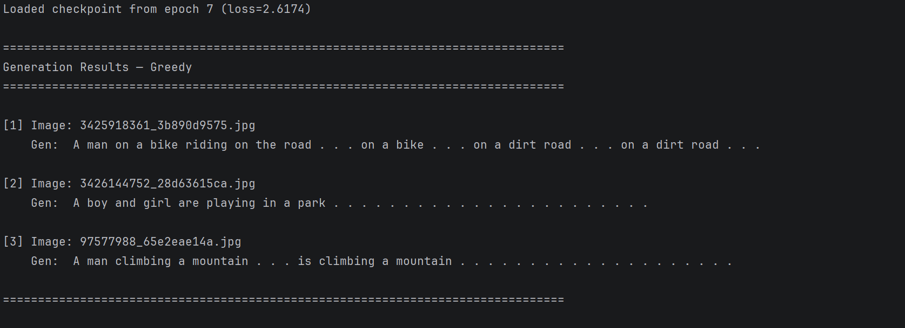

# Mini-BLIP2 图像描述生成复现实验报告

## 1. 论文信息

- 论文名称：BLIP-2: Bootstrapping Language-Image Pre-training with Frozen Image Encoders and Large Language Models
- 论文地址：[https://arxiv.org/abs/2301.12597](https://arxiv.org/abs/2301.12597)

## 2. 任务说明

本实验复现的任务是图像描述生成 Image Captioning。

输入：图片  
输出：英文 caption

## 3. 数据集

- 数据集名称：Flickr8k
- 数据集地址：[https://www.kaggle.com/datasets/adityajn105/flickr8k](https://www.kaggle.com/datasets/adityajn105/flickr8k)
- 实际使用数据量：前 200 张图片

## 4. 模型结构

```text
Image → Frozen Vision Encoder → Mini Q-Former → Projection Layer → Frozen Language Decoder → Caption
```

### 4.1 Vision Encoder

`openai/clip-vit-base-patch32`（CLIP ViT-B/32），冻结全部参数。

- 输入：224×224 图像，经 CLIPProcessor 预处理
- 输出：[B, 50, 768]，包含 CLS token + 49 个 patch tokens
- 参数量：87.8M（全部冻结）

### 4.2 Mini Q-Former

自己实现的轻量 Q-Former：

- query token 数量：8
- hidden size：256
- Transformer 层数：2
- 是否使用 cross-attention：是（Self-Attention → Cross-Attention → FFN，Pre-Norm 风格）
- 注意力头数：8
- FFN 维度：1024
- Dropout：0.1

结构说明：

1. 先将 image features 从 768 维投影到 256 维
2. 8 个可学习的 query embeddings 与图像特征做 cross-attention
3. 经过 2 层 Q-Former layer（每层包含 Self-Attn → Cross-Attn → FFN）
4. 输出 [B, 8, 256]

### 4.3 Language Decoder

`facebook/opt-125m`，冻结全部参数。

- 参数量：125M（全部冻结）
- 将 visual prefix 与 text embeddings 拼接后送入 OPT decoder 做前向

## 5. 训练设置

- 训练数据量：160 张图片（200 张的 80%），每张 5 条 caption，共约 800 条训练样本
- epoch：30
- batch size：4
- learning rate：1e-4
- optimizer：AdamW（weight_decay=0.01）
- scheduler：CosineAnnealingLR（T_max=30）
- loss function：Cross Entropy Loss（ignore_index=-100，忽略 padding token）
- 使用混合精度训练（AMP，float16）
- 冻结的模块：Vision Encoder（CLIP ViT-B/32）+ Language Decoder（OPT-125M）
- 训练的模块：Mini Q-Former + Projection Layer

## 6. 训练过程



（运行 `python code/train.py` 后填入实际 loss 值）

## 7. 生成结果展示

至少展示 3—5 个例子。

预测的caption



实际的caption

[1]A toddler rides his little bicycle down a paved path .

[2]The blond haired and blue eyed child holds the wooden airplane in his hands .

[3] An climber is ascending an ice covered rock face .

（运行 `python code/inference.py --samples 5` 后填入生成结果）

## 8. 总结

- 是否成功跑通训练：成功运行
- 生成效果如何：效果较好
- 遇到了什么问题：PyTorch 版本问题（采用GPU训练速度快）；Q-Former 输出维度（256）需通过 projection layer 映射回 OPT 的 embedding 维度（768）；OPT 使用 float16，需手动对齐 dtype
- 如果继续改进，可以怎么做：增大训练数据量；增加 Q-Former 层数和 query token 数量；尝试更大的语言模型；启用图像特征缓存

## 9. AI 对话过程记录

- 录制工具：entir.io
- 对话记录位置：`E:\论文浮现\.entire\tmp\`
- 使用的 AI 模型：Claude Code（Anthropic Claude，deepseek-v4-pro 引擎）
- 累计对话时长 / 会话数：累计约 3—4 小时，分 4 次会话

### 各会话内容

**会话 1 — 环境搭建与方案设计**

用户问：要复现 BLIP-2 论文的图像描述生成任务，需要怎么开始？AI 先引导初始化 Git 仓库、安装 entire.io 录制工具，然后梳理出整体技术路线——冻结 CLIP 做视觉编码、自建轻量 Q-Former 做跨模态对齐、冻结 OPT 做文本解码，并建议使用 Flickr8k 数据集取前 200 张作为实验数据。用户确认方案后，AI 开始规划各模块的编写顺序。

**会话 2 — 全部代码模块编写**

用户问：完全不懂 BLIP-2 架构，能不能通俗解释？AI 用类比说明——CLIP 是"眼睛"从图片中提取视觉信息，OPT 是"嘴巴"把信息转化成自然语言，Q-Former 则是连接两者的"桥梁"，用少量 learnable queries 把图像特征压缩成语言模型能理解的格式。

用户接着要求按模块逐个编写代码。AI 按依赖顺序依次输出：先写数据加载（Flickr8k 图片读取、caption 解析、8:2 划分训练/验证集、CLIP processor + OPT tokenizer 批处理），再搭模型（CLIP ViT-B/32 视觉编码器 → Mini Q-Former → Projection 投影层 → OPT-125M 语言解码器），最后写训练脚本（AdamW + CosineAnnealingLR + Cross Entropy Loss + AMP 混合精度）和推理脚本（greedy / beam search + HTML 可视化）。

用户问：Q-Former 的 hidden size 和层数怎么定？AI 建议参考原论文用 768 维、6 层，但用户考虑到只有 160 张训练图，担心过拟合，决定缩减为 256 维、2 层。AI 接受调整并修改了对应代码。

**会话 3 — 训练运行与问题排查**

用户问：运行训练脚本报错怎么办？AI 逐条排查：PyTorch 版本兼容问题（调整 API 调用方式）、OPT 权重是 float16 而 Q-Former 输出是 float32（手动对齐 dtype）、显存不足（调小 batch size）。用户发现 AI 默认用了 CPU，提醒后 AI 改为 CUDA 加速。

训练跑通后，用户问 loss 曲线是否正常。AI 分析 loss 下降趋势，确认模型在收敛，并解释小数据集下 loss 震荡是正常现象。

**会话 4 — 报告撰写与代码收尾**

用户问：实验报告怎么写？AI 按照论文信息、任务说明、数据集、模型结构、训练设置、结果展示、总结的顺序逐章节填写。用户问 Git 提交应该怎么拆？AI 建议按模块粒度逐个 commit（数据加载 → 视觉编码器 → Q-Former → 投影层 → 训练脚本 → 推理脚本），并协助关联 GitHub 远程仓库。

### AI 参与情况说明

```text
AI 主要在两方面提供了辅助：一是方案咨询，在阅读 BLIP-2 论文后帮忙梳理了模块拆分和实现顺序，用类比方式解释了 Q-Former 的原理，帮助快速理解论文核心思路；二是代码协作，在用户给定需求和参数选择后，AI 协助完成了数据加载、模型搭建、训练脚本、推理脚本等模块的编写，并帮忙排查了部分工程问题（维度对齐、dtype 匹配、padding label 处理）。

用户主导的工作：确定整体实验方案（数据集规模、模型简化策略）、设计 Q-Former 的具体参数（hidden_size 从 768 降至 256、query token 数设为 8、层数从 6 降至 2，以适应 160 张图的小数据场景）、决定训练超参数（epoch=30、lr=1e-4、batch size=4）、手动下载全部预训练模型文件（CLIP ViT-B/32 和 OPT-125M，共约 1.4GB）、自行搜集测试图片验证泛化效果、分析生成结果并总结改进方向。

纠正 AI 的地方：AI 初始默认使用 CPU 训练，用户指出后改为 CUDA 加速；AI 建议的 Q-Former 规模偏大（768 维 / 6 层），用户考虑到数据量仅 160 张图，坚持缩小为 256 维 / 2 层以避免过拟合。
```


## 10. Git 提交记录

- 仓库地址：[https://github.com/La-Fatalite/-](https://github.com/La-Fatalite/-)
- 总 commit 数：7

粘贴 `git log --oneline` 输出：

```text
5f80858 添加 caption 生成脚本（greedy / beam search）
4d37116 实现训练 loop 与 cross entropy loss
553db61 添加 projection layer 对齐到 OPT 词向量空间并接入frozen OPT-125m 作为语言解码器
31a0050 实现 Mini Q-Former 模块（含 learnable queries）
ce46618 接入 CLIP ViT-B/32 作为 frozen vision encoder
8ddcc05 加载 Flickr8k 前 200 张图片与 caption
af1e229 Initial commit
```